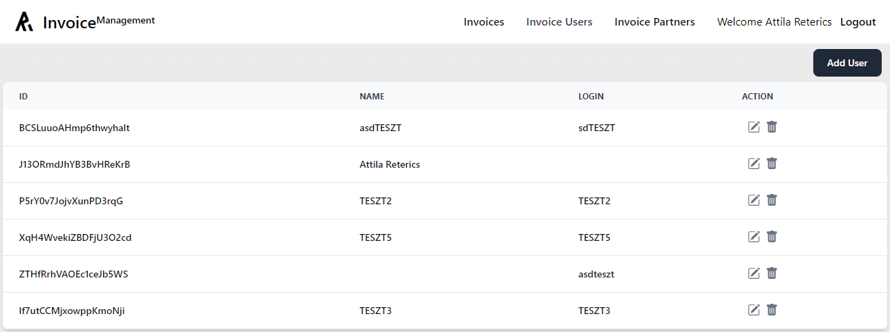

# Invoice Management

[](https://github.com/Reterics/invoice-management/actions/workflows/npm-publish-github-packages.yml)

This is a [Next.js](https://nextjs.org/) project with [TailwindCSS](https://tailwindcss.com/) and [Firebase](https://firebase.google.com/) where we can create, manage our invoices, partners, and customers. The application generates XML output that compatible with the [Hungarian National Tax and Customs API (NAV)](https://onlineszamla.nav.gov.hu/api/files/container/download/Online_Szamla_interfesz%20specifikacio_HU_v3.0.pdf).

## Install

For the latest stable version

```bash
npm install
npm run build
npm run start
```

Open [http://localhost:3000](http://localhost:3000) with your browser to see the result.



## Contribute

There are many ways to [contribute](https://github.com/Reterics/invoice-management/blob/main/CONTRIBUTING.md) to Invoice Management.
* [Submit bugs](https://github.com/Reterics/invoice-management/issues) and help us verify fixes as they are checked in.
* Review the [source code changes](https://github.com/Reterics/invoice-management/pulls).
* [Contribute bug fixes](https://github.com/Reterics/invoice-management/blob/main/CONTRIBUTING.md).

